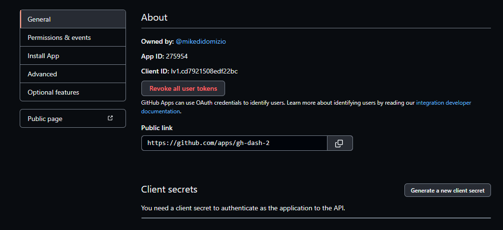

# GitHub App Organization Private Repo

The purpose of this repository is to show a simple example of how to use a GitHub app to access an organization's private repositories.

I found this was a bit tricky

It is done using NextJS and follows a similar flow to how [Netlify](netlify.com) fetches repositories.

## Quick start

This quick start assumes you have a GitHub organization you are part of that has private (or public) repositories.

- Create a new [GitHub application in GitHub](https://github.com/settings/apps/new)

The following settings are expected:

- `GitHub App name` is the app name that users will see when installing this application.  For demo purposes it's not really important and can be changed later.
- `Homepage URL` can be anything, for this demo we will use `http://localhost:3000`.
- `Callback URL` will be `http://localhost:3000`.  This is for demo purposes and in a production environment would redirect to your production website.
- `Setup URL (optional)` will be `http://localhost:3000`.  The purpose of this is for our demo we will redirect back after install, and close the window.  In a real environment you may not want this.
- `Redirect on update` should be checked ✔.
- `Active` checkbox under `Webhook` can be unchecked.
- Under `Permissions`, `Repository permissions` find the entry for `Contents`.  To the right of it should be a dropdown, open it and set it to `Read-only`.
- Under `Where can this GitHub App be installed?` select `Any account`.

Click `Create GitHub App` button at the bottom

You should have a new GitHub app now!

At the top of this page is a Client ID



This is used by GitHub to know which application you're talking about when redirecting to GitHub.
Below this should be a button to `Generate a new client secret`

A secret should be generated.  This secret is used to fetch an access token from GitHub after redirection.

⚠ The secret is a secret, and should be stored properly.

We are almost done.  Clone this project and 

```shell
$ git clone https://github.com/mikedidomizio/github-app-organization-private-repos
$ cd ./github-app-organization-private-repos
$ npm install
$ export GITHUB_ID= ... # this is the GitHub ID of the application
$ export GITHUB_SECRET= ... # this is the secret of the application
$ export GITHUB_APP_NAME= ... # this is the app name that can be retrieved under `Public link` on the app page after the final forward slash
$ export GITHUB_REDIRECT_URL=http://localhost:3000 # demo purposes
# npm run dev

```

Once the Next server has started, go to http://localhost:3000.

Congratulations your GitHub application can authenticate you and access an organization's private repositories.
